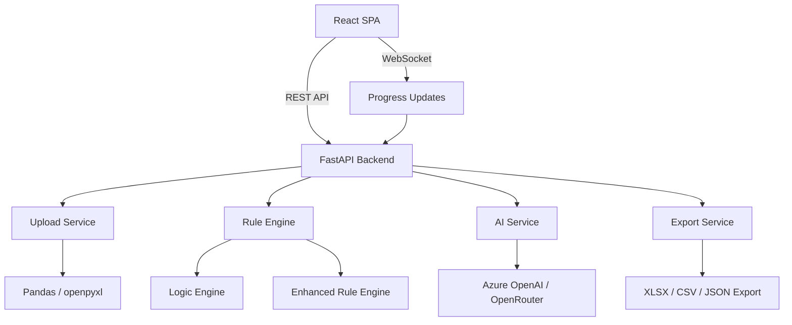

# MWCS UI Migration Plan: Streamlit → React + FastAPI

## 1. Overview

Migrate the Maintenance Work Categorization System from a Streamlit monolith to a modern **React (TypeScript) frontend** with a **FastAPI (Python) backend**. This preserves all existing Python business logic while delivering a dramatically better user experience.

### Why React + FastAPI?

| Concern | Streamlit | React + FastAPI |
|---|---|---|
| UI Flexibility | Widget-based, limited layout | Full CSS/component control |
| Interactivity | Full page reruns on every action | SPA with instant client-side updates |
| State Management | Session state, fragile on rerun | React state/context, predictable |
| Data Tables | Basic `st.dataframe` | AG Grid / TanStack Table with sorting, filtering, pagination |
| Charts | Plotly via `st.plotly_chart` | Recharts or Plotly.js with full interactivity |
| File Upload | Single widget | Drag-and-drop with progress, preview |
| Rule Builder | Forms with reruns | Interactive drag-and-drop, real-time validation |
| Theming | Limited | Tailwind CSS + shadcn/ui component library |
| Performance | Rerenders entire page | Virtual DOM, only changed components update |

---

## 2. Architecture

```
┌─────────────────────────────────────────────────────────────┐
│                    React Frontend (Vite + TS)                │
│  ┌──────────┐ ┌──────────┐ ┌──────────┐ ┌──────────┐       │
│  │  Upload   │ │  Rules   │ │ Preview  │ │ Results  │       │
│  │  Page     │ │  Page    │ │  Page    │ │  Page    │       │
│  └────┬─────┘ └────┬─────┘ └────┬─────┘ └────┬─────┘       │
│       │             │            │             │              │
│  ┌────▼─────────────▼────────────▼─────────────▼──────┐     │
│  │              API Client Layer (fetch/axios)         │     │
│  └────────────────────────┬───────────────────────────┘     │
└───────────────────────────┼─────────────────────────────────┘
                            │ HTTP/REST + WebSocket
┌───────────────────────────▼─────────────────────────────────┐
│                    FastAPI Backend                            │
│  ┌──────────────────────────────────────────────────────┐   │
│  │                   API Router Layer                    │   │
│  │  /api/upload  /api/rules  /api/preview  /api/process │   │
│  │  /api/export  /api/datasets  /ws/progress            │   │
│  └───────────────┬──────────────────┬───────────────────┘   │
│                  │                  │                         │
│          ┌───────▼──────┐  ┌───────▼────────┐               │
│          │  Data Layer   │  │  Logic Engine  │               │
│          │  upload.py    │  │  logic_engine  │               │
│          │  export.py    │  │  rules.py      │               │
│          └───────┬───────┘  └───────┬────────┘               │
│                  │                  │                         │
│          ┌───────▼──────────────────▼────────┐               │
│          │     AI Justification Service       │               │
│          │     ai_service.py                  │               │
│          └───────────────────────────────────┘               │
└─────────────────────────────────────────────────────────────┘
```

### Mermaid Flow Diagram



---

## 3. Tech Stack

### Frontend
| Layer | Technology | Purpose |
|---|---|---|
| Framework | React 18 + TypeScript | Component-based UI |
| Build Tool | Vite | Fast dev server and builds |
| Routing | React Router v6 | SPA navigation |
| State | Zustand or React Context | Global state management |
| UI Components | shadcn/ui + Radix UI | Accessible, polished components |
| Styling | Tailwind CSS | Utility-first CSS |
| Data Tables | TanStack Table | Sorting, filtering, pagination |
| Charts | Recharts | Dashboard visualizations |
| File Upload | react-dropzone | Drag-and-drop upload |
| Forms | React Hook Form + Zod | Form validation |
| HTTP Client | Axios or fetch | API communication |
| Icons | Lucide React | Consistent iconography |

### Backend
| Layer | Technology | Purpose |
|---|---|---|
| Framework | FastAPI | Async Python API |
| Server | Uvicorn | ASGI server |
| Validation | Pydantic v2 | Request/response models |
| WebSocket | FastAPI WebSocket | Real-time progress |
| CORS | FastAPI CORS middleware | Cross-origin for dev |
| File Handling | python-multipart | File upload parsing |
| Existing Logic | All `src/*.py` modules | Reused as-is |

---

## 4. Directory Structure

```
project-root/
├── backend/
│   ├── main.py                    # FastAPI entry point
│   ├── requirements.txt           # Python dependencies
│   ├── .env.example
│   ├── api/
│   │   ├── __init__.py
│   │   ├── routes/
│   │   │   ├── __init__.py
│   │   │   ├── upload.py          # POST /api/upload
│   │   │   ├── rules.py           # CRUD /api/rules/*
│   │   │   ├── preview.py         # POST /api/preview
│   │   │   ├── process.py         # POST /api/process + WS
│   │   │   ├── export.py          # GET /api/export/*
│   │   │   └── datasets.py        # GET/POST /api/datasets/*
│   │   ├── models/
│   │   │   ├── __init__.py
│   │   │   ├── upload.py          # Pydantic models for upload
│   │   │   ├── rules.py           # Pydantic models for rules
│   │   │   ├── process.py         # Pydantic models for processing
│   │   │   └── export.py          # Pydantic models for export
│   │   └── services/
│   │       ├── __init__.py
│   │       ├── session_store.py   # In-memory session management
│   │       └── websocket.py       # WebSocket manager
│   └── src/                       # Existing business logic (moved)
│       ├── __init__.py
│       ├── ai_service.py
│       ├── ai_code_generator.py
│       ├── enhanced_rule_engine.py
│       ├── export.py
│       ├── logic_engine.py
│       ├── predefined_functions.py
│       ├── rule_config_manager.py
│       ├── rules.py
│       ├── supporting_datasets.py
│       ├── upload.py
│       └── visualise.py
│
├── frontend/
│   ├── package.json
│   ├── tsconfig.json
│   ├── vite.config.ts
│   ├── tailwind.config.ts
│   ├── index.html
│   ├── public/
│   ├── src/
│   │   ├── main.tsx
│   │   ├── App.tsx
│   │   ├── api/
│   │   │   ├── client.ts           # Axios/fetch setup
│   │   │   ├── upload.ts           # Upload API calls
│   │   │   ├── rules.ts            # Rules API calls
│   │   │   ├── process.ts          # Process API calls
│   │   │   └── export.ts           # Export API calls
│   │   ├── components/
│   │   │   ├── ui/                  # shadcn/ui components
│   │   │   ├── layout/
│   │   │   │   ├── AppLayout.tsx
│   │   │   │   ├── Sidebar.tsx
│   │   │   │   ├── Stepper.tsx
│   │   │   │   └── Header.tsx
│   │   │   ├── upload/
│   │   │   │   ├── FileDropzone.tsx
│   │   │   │   ├── DataPreview.tsx
│   │   │   │   └── ColumnStats.tsx
│   │   │   ├── rules/
│   │   │   │   ├── RuleBuilder.tsx
│   │   │   │   ├── ConditionRuleForm.tsx
│   │   │   │   ├── FunctionRuleForm.tsx
│   │   │   │   ├── AIRuleForm.tsx
│   │   │   │   ├── RuleList.tsx
│   │   │   │   ├── RuleCard.tsx
│   │   │   │   ├── TemplateLoader.tsx
│   │   │   │   ├── RuleConnections.tsx
│   │   │   │   └── DatasetPairing.tsx
│   │   │   ├── preview/
│   │   │   │   ├── RuleFlowchart.tsx
│   │   │   │   └── SamplePreview.tsx
│   │   │   ├── process/
│   │   │   │   ├── AIConfig.tsx
│   │   │   │   ├── ProcessingProgress.tsx
│   │   │   │   └── ProcessingSummary.tsx
│   │   │   └── results/
│   │   │       ├── SummaryMetrics.tsx
│   │   │       ├── ResultsCharts.tsx
│   │   │       ├── ResultsTable.tsx
│   │   │       ├── ExportButtons.tsx
│   │   │       └── AuditMetadata.tsx
│   │   ├── pages/
│   │   │   ├── UploadPage.tsx
│   │   │   ├── RulesPage.tsx
│   │   │   ├── PreviewPage.tsx
│   │   │   ├── ProcessPage.tsx
│   │   │   └── ResultsPage.tsx
│   │   ├── store/
│   │   │   ├── useAppStore.ts       # Zustand store
│   │   │   └── types.ts             # TypeScript interfaces
│   │   ├── hooks/
│   │   │   ├── useUpload.ts
│   │   │   ├── useRules.ts
│   │   │   ├── useProcess.ts
│   │   │   └── useWebSocket.ts
│   │   ├── lib/
│   │   │   └── utils.ts
│   │   └── styles/
│   │       └── globals.css
│   └── components.json              # shadcn/ui config
│
├── sample_data/
│   └── sample_maintenance_data.xlsx
├── docs/
├── tests/
├── plans/
└── README.md
```

---

## 5. API Design

### 5.1 Upload Endpoints

| Method | Path | Description |
|---|---|---|
| POST | `/api/upload` | Upload Excel file, returns session_id + preview |
| GET | `/api/upload/{session_id}/preview` | Get data preview with pagination |
| GET | `/api/upload/{session_id}/stats` | Get column statistics |
| GET | `/api/upload/{session_id}/sheets` | List available sheets |

**POST /api/upload** response:
```json
{
  "session_id": "uuid",
  "filename": "data.xlsx",
  "total_rows": 1500,
  "columns": ["Work ID", "Description", "Priority", ...],
  "validation": {
    "is_valid": true,
    "errors": [],
    "warnings": ["Optional column 'Asset ID' not found"],
    "missing_required": [],
    "missing_optional": ["Asset ID"]
  },
  "preview": [{"Work ID": "W001", ...}, ...]
}
```

### 5.2 Rules Endpoints

| Method | Path | Description |
|---|---|---|
| GET | `/api/rules/{session_id}` | Get all rules for session |
| POST | `/api/rules/{session_id}/standard` | Add standard rule |
| POST | `/api/rules/{session_id}/condition` | Add condition rule |
| POST | `/api/rules/{session_id}/function` | Add function rule |
| POST | `/api/rules/{session_id}/ai` | Add AI rule |
| DELETE | `/api/rules/{session_id}/{rule_id}` | Delete a rule |
| PUT | `/api/rules/{session_id}/{rule_id}` | Update a rule |
| GET | `/api/rules/templates` | List available templates |
| POST | `/api/rules/{session_id}/load-template` | Load a template |
| POST | `/api/rules/{session_id}/save-template` | Save current as template |
| GET | `/api/rules/functions` | List available predefined functions |
| POST | `/api/rules/{session_id}/connections` | Add rule connection |
| DELETE | `/api/rules/{session_id}/connections/{conn_id}` | Delete connection |

### 5.3 Preview Endpoints

| Method | Path | Description |
|---|---|---|
| GET | `/api/preview/{session_id}/flowchart` | Get flowchart data for rendering |
| GET | `/api/preview/{session_id}/sample` | Get sample evaluation preview |

### 5.4 Processing Endpoints

| Method | Path | Description |
|---|---|---|
| POST | `/api/process/{session_id}` | Start processing |
| WS | `/ws/process/{session_id}` | WebSocket for progress updates |
| GET | `/api/process/{session_id}/status` | Get processing status |
| GET | `/api/process/{session_id}/summary` | Get processing summary |

### 5.5 Export Endpoints

| Method | Path | Description |
|---|---|---|
| GET | `/api/export/{session_id}/xlsx` | Download Excel |
| GET | `/api/export/{session_id}/csv` | Download CSV |
| GET | `/api/export/{session_id}/json` | Download JSON |
| GET | `/api/export/{session_id}/metadata` | Get audit metadata |
| POST | `/api/export/{session_id}/filter` | Get filtered results |

### 5.6 Supporting Datasets Endpoints

| Method | Path | Description |
|---|---|---|
| GET | `/api/datasets/equipment-classification` | Get equipment classifications |
| GET | `/api/datasets/work-type` | Get work type categories |
| GET | `/api/datasets/redundancy` | Get equipment redundancy data |
| GET | `/api/datasets/decision-matrix` | Get decision matrix |

---

## 6. Session Management

Since the app is local-only, we use a simple in-memory session store:

```python
# backend/api/services/session_store.py
class SessionStore:
    """In-memory session store for local development."""
    sessions: dict[str, SessionData] = {}

@dataclass
class SessionData:
    session_id: str
    uploaded_data: Optional[UploadedData]
    rule_builder: RuleBuilder
    enhanced_rule_engine: EnhancedRuleEngine
    logic_engine: LogicEngine
    export_manager: ExportManager
    evaluation_results: Optional[BatchEvaluationResult]
    justification_results: Optional[list]
    created_at: datetime
```

---

## 7. Frontend Page Designs

### 7.1 Upload Page
- **Drag-and-drop zone** with file type validation and size indicator
- **Data preview table** using TanStack Table with column sorting
- **Column statistics panel** showing types, null counts, unique values
- **Validation status** with clear error/warning badges
- **Sheet selector** dropdown for multi-sheet workbooks

### 7.2 Rules Page
- **Tab navigation**: Standard Rules | Condition Rules | Function Rules | AI Rules | Datasets | Config
- **Rule builder forms** with real-time validation
- **Rule list** with drag-to-reorder, enable/disable toggles, inline delete
- **Template browser** with preview before loading
- **Dataset pairing** configuration with visual join preview
- **Rule connections** visual editor showing flow between rules

### 7.3 Preview Page
- **Interactive flowchart** rendered with React Flow or D3.js
- **Sample evaluation table** showing expected outcomes
- **Side-by-side layout** with flowchart left, table right

### 7.4 Process Page
- **AI configuration panel** with provider selection and key management
- **Real-time progress bar** via WebSocket
- **Live processing log** showing current row and matched rules
- **Summary cards** appearing as processing completes

### 7.5 Results Page
- **Dashboard cards**: Accepted/Rejected/Reconsider counts with percentages
- **Interactive charts**: pie chart, confidence distribution, category breakdown
- **Filterable data table** with status badges, confidence bars
- **Export section** with format selection and download buttons
- **Audit metadata** collapsible panel

---

## 8. Key UI Improvements Over Streamlit

1. **No page reruns** — React SPA updates only what changes
2. **Drag-and-drop file upload** with progress indicator
3. **Rich data tables** with sorting, filtering, pagination, column resizing
4. **Interactive rule builder** with real-time validation and visual feedback
5. **Visual rule flow editor** using React Flow for drag-and-drop connections
6. **Real-time processing progress** via WebSocket instead of polling
7. **Responsive layout** that works on different screen sizes
8. **Dark/light theme** toggle
9. **Toast notifications** for success/error feedback
10. **Keyboard shortcuts** for power users
11. **Better form UX** with inline validation, auto-save, undo
12. **Collapsible panels** and resizable split views

---

## 9. Migration Strategy

### Phase 1: Backend API (FastAPI)
1. Create FastAPI project structure
2. Move existing `src/` modules into `backend/src/`
3. Create Pydantic models for all API request/response types
4. Implement API routes that wrap existing business logic
5. Add session management
6. Add WebSocket for processing progress
7. Test all endpoints

### Phase 2: Frontend Shell
1. Scaffold React + Vite + TypeScript project
2. Install and configure Tailwind CSS + shadcn/ui
3. Build layout components: sidebar, stepper, header
4. Set up React Router with all 5 pages
5. Set up Zustand store with TypeScript types
6. Create API client layer

### Phase 3: Page Implementation
1. Upload page with dropzone and data preview
2. Rules page with all rule type builders
3. Preview page with flowchart and sample table
4. Process page with progress tracking
5. Results page with charts and export

### Phase 4: Polish
1. Error handling and loading states
2. Dark/light theme
3. Responsive design
4. Keyboard shortcuts
5. Update documentation

---

## 10. Running the Application

### Development
```bash
# Terminal 1: Backend
cd backend
pip install -r requirements.txt
uvicorn main:app --reload --port 8000

# Terminal 2: Frontend
cd frontend
npm install
npm run dev
# Opens at http://localhost:5173, proxies API to :8000
```

### Production (local)
```bash
# Build frontend
cd frontend && npm run build

# Serve everything from FastAPI
cd backend
uvicorn main:app --port 8000
# Frontend served as static files from backend
```

---

## 11. What Stays the Same

All existing Python business logic is **preserved unchanged**:
- `src/upload.py` — file parsing and validation
- `src/rules.py` — rule definitions and templates
- `src/logic_engine.py` — rule evaluation
- `src/enhanced_rule_engine.py` — enhanced 3-type rule engine
- `src/ai_service.py` — AI justification generation
- `src/export.py` — export file generation
- `src/visualise.py` — chart data generation (adapted for JSON output)
- `src/predefined_functions.py` — function registry
- `src/rule_config_manager.py` — config save/load
- `src/supporting_datasets.py` — dataset management

The only changes to these files will be minor adaptations to return JSON-serializable data instead of Streamlit widgets.
